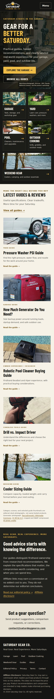
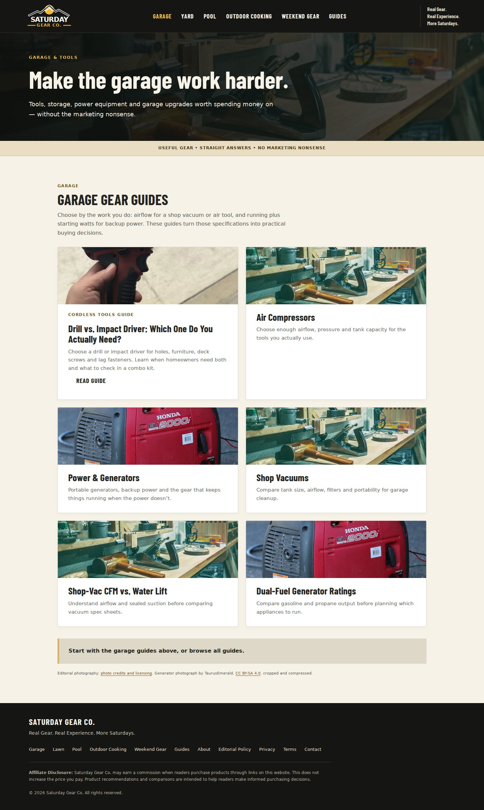
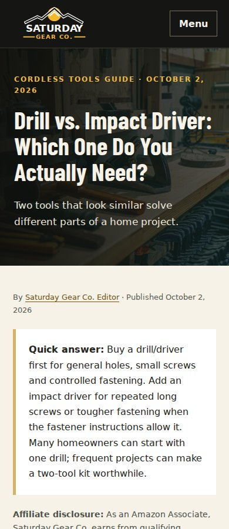

# Garage redesign review — Issue #1

The homepage now follows the approved garage direction: charcoal, warm cream and gold, a photographic workshop hero, “Gear for a better Saturday,” the approved tagline, five photographic category tiles, and five existing guide cards. The identity continues through every category, guide, policy and author template. All imagery is genuine existing owner photography or licensed editorial photography; the generated mockup is not shipped.

## Preservation and privacy

- All 39 existing HTML routes remain; all 25 guide bodies retain their content. The only text change in articles replaces the owner’s first name with `Saturday Gear Co. Editor` or `the editor’s`.
- Article schema types, dates, IDs, canonical URLs, titles, descriptions, robots directives, Open Graph and Twitter metadata remain. Person display names are anonymized consistently in schema and bylines.
- All 31 affiliate links retain destinations, tags, attributes and placement; the affiliate event script and shared affiliate component stylesheet are byte-for-byte unchanged. GA4 configuration, Impact verification, sitemap, robots and owner photographs are unchanged.
- `/author/nicholas` remains accessible to preserve existing URLs and canonicals. Its displayed name and identifying prose are anonymized. **The historical slug still contains a first name**, and old Git history and search caches cannot be erased by this redesign. A full removal of that slug would require a separately reviewed URL migration with a permanent server redirect and canonical/sitemap changes; no unsupported hosting rules were added.
- Scrollable comparison tables gain keyboard focus and an accessible region label. Article wording and affiliate recommendations are otherwise unchanged.

## Validation

`python tests/verify_redesign.py` checks protected content, metadata, schema, analytics, affiliate attributes, assets, local links and anchors against commit `83e94dd57e226590bdca7d733a54ffa254ec67b2`.

`node tests/browser-qa.cjs` checks all 39 pages at 390px and 1440px, extra homepage widths (320/768/1024/1920), keyboard menu/skip link/Escape, navigation without JavaScript, asset/console failures, automated WCAG A/AA rules, and a real DOM referral click with GA4 event inspection. All external traffic is intercepted; no test visits or conversions are sent to Google or Amazon. Run with Playwright and axe-core installed in a development environment; `CHROME_PATH` is optional for a custom Chromium binary.

`CHROME_PATH=/path/to/chromium node tests/performance.cjs` runs local Lighthouse mobile/desktop comparisons. Lighthouse must be installed in the development environment. `--redesign-mobile` refreshes only that result. No development dependencies are shipped to production. Results live in `browser-qa.json` and `performance-qa.json`.

- Preservation: PASS — 39 pages, 25 articles, 31 affiliate links, 918 internal links.
- Rendering: PASS — 78 page layouts, no horizontal overflow, missing local assets or JavaScript errors.
- Accessibility: PASS — no detected WCAG 2 A/AA or 2.1 AA violations; keyboard and no-JavaScript checks pass. Automated checks do not establish complete accessibility conformance.
- Affiliate analytics: PASS — `affiliate_click` retains `page_path`, `product_name`, `link_placement`, `destination_url`, `link_domain`; destination unchanged. Collection and GA4 reporting remain a production check.
- Lighthouse: redesigned desktop 100 performance, 100 accessibility, 100 best practices and 100 SEO. Redesigned mobile: 99 performance, 100 accessibility, 100 best practices and 100 SEO; simulated LCP 2.18s, TBT 0ms and CLS 0. Desktop simulated LCP 0.78s and CLS 0. Results and timings are recorded in `performance-qa.json`. Font preload removes observed layout shift. The original mobile performance score is unavailable because Chromium/Lighthouse produced no screenshot frames; this invalid result is retained as `null`, not treated as a score of zero.

## Screenshots

## Deployment and rollback

1. Owner reviews the PR and explicitly approves live deployment, as Issue #1 requires. Do not auto-merge or deploy from this implementation task.
2. Confirm the existing production host and its deployment mechanism. The repository contains no hosting configuration or build pipeline, and the existing main commit has no GitHub status checks. No replacement host or paid preview service has been created.
3. If available on the current plan, build a branch preview through the existing host and confirm extensionless routes, caching/MIME types for WebP and WOFF, header/menu behavior and the preserved sitemap. Do not enable a paid preview feature.
4. After approval, merge this feature branch and deploy the existing static document root through the established mechanism. There is no application build step. Exclude `docs/` and `tests/` if the existing publishing process supports it; no production files depend on them.
5. Check live desktop/mobile homepage, category and article URLs, HTTP status/canonicals, sitemap/robots, Search Console verification, GA4 realtime and affiliate event dimensions, and actual field performance. Do not make purchases or trigger affiliate conversions during checks.
6. If routes, affiliate tracking, SEO or rendering regress, restore the prior host deployment or revert the redesign commit through a new revert PR and redeploy the prior main revision `83e94dd57e226590bdca7d733a54ffa254ec67b2`. No content/data migration is required.

## Cost and readiness

No purchases, subscriptions, paid services, or production deployment were performed. Additional cost: $0. Implementation and local QA are complete; ready for PR review. Live deployment is gated on owner approval and identification of the existing hosting mechanism. The residual author slug and the invalid baseline mobile Lighthouse score are disclosed above.
